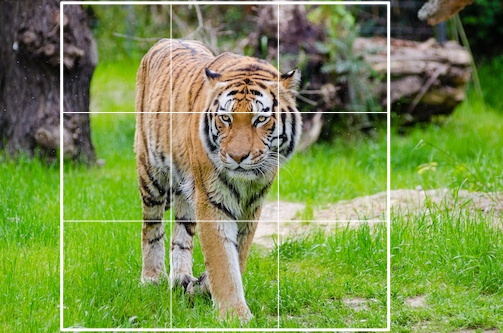
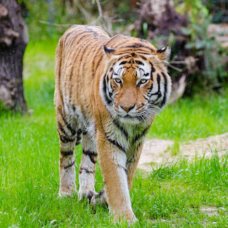

[](https://badge.fury.io/js/abraia)
[](https://travis-ci.org/abraia/abraia-nodejs)
[](https://coveralls.io/github/abraia/abraia-nodejs?branch=master)

# Abraia API client for Node.js

Node.js client for [Abraia](https://abraia.me) services. It is used to
intelligently transform and optimize (compress) images for web. Read more at
[https://abraia.me/docs](https://abraia.me/docs).

## Installation

Install the API client:

```
npm install --save abraia
```

## Usage

You just need to defiene the API Keys as environment variables (ABRAIA_API_KEY and
ABRAIA_API_SECRET) and use the fluent API.

```js
const abraia = require('abraia/abraia')

abraia.fromFile('images/tiger.jpg')
  .resize({ width: 333, height: 333 })
  .toFile('images/tiger_333x333.jpg')

abraia.fromUrl('https://abraia.me/images/random.jpg')
  .resize({ width: 600 })
  .toFile('images/random_600.jpg')

abraia.fromStore('demo/birds.jpg')
  .toFile('images/birds.jpg')
```

<center>
</center>

## License

This software is licensed under the MIT License. [View the license](LICENSE).
