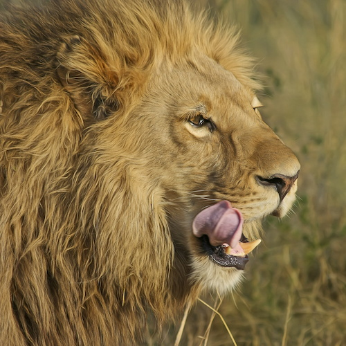

[](https://travis-ci.org/abraia/abraia-nodejs)
[](https://coveralls.io/github/abraia/abraia-nodejs?branch=master)

# Abraia API client for Node.js

Node.js client for the [Abraia](https://abraia.me) services, used to transform
and optimize (compress) images on-line intelligently. Read more at
[https://abraia.me/docs](https://abraia.me/docs).

## Installation

Install the API client:

```
npm install --save abraia
```

## Usage

```js
const abraia = require('abraia')

abraia.fromFile('images/lion.jpg')
  .resize({width: 500, height: 500})
  .toFile('images/lion_500x500.jpg')

abraia.fromUrl('https://abraia.me/images/random.jpg')
  .resize({width: 600, height: 400})
  .toFile('images/random_600x400.jpg')
```



## License

This software is licensed under the MIT License. [View the license](LICENSE).
